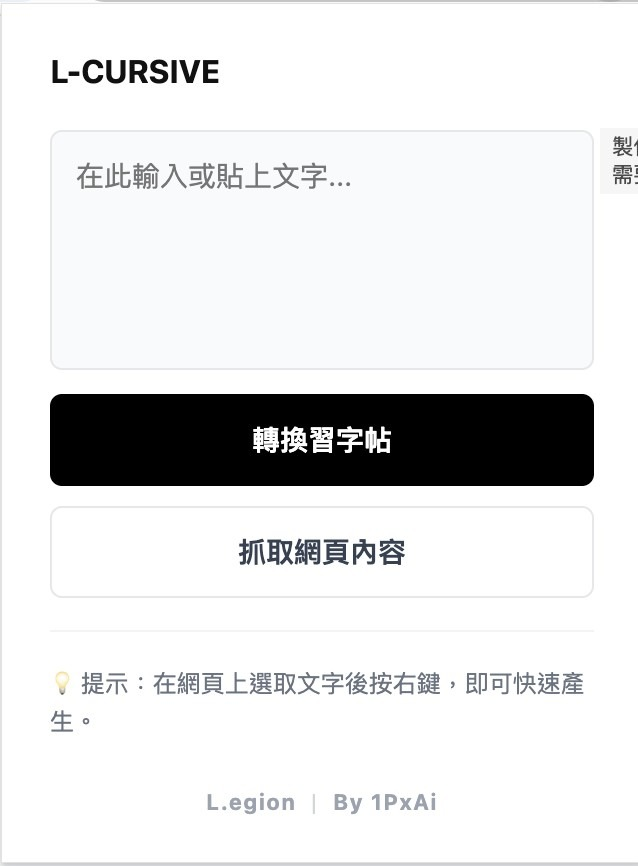
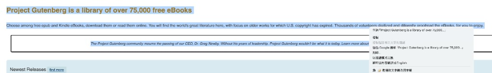
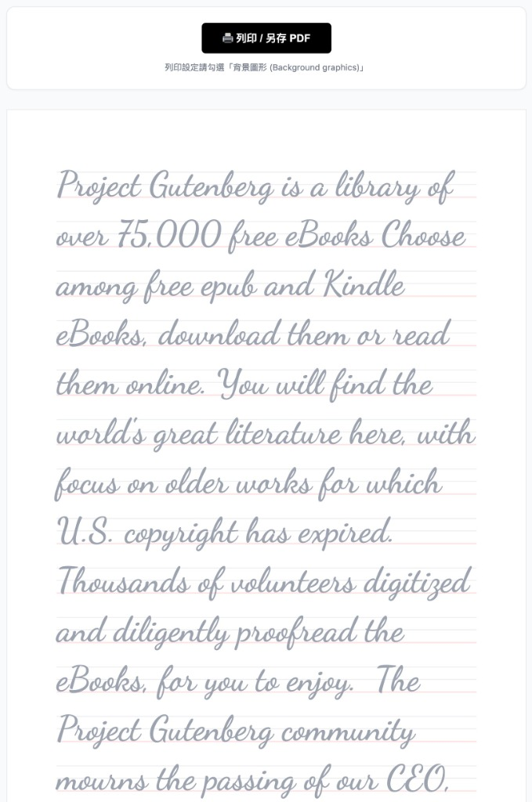

# L-Cursive: 英文草寫學習系統

這是一個整合了 Web 練習介面與瀏覽器擴充功能（Chrome Extension）的英文草寫教學系統。

---

## 🛠️ L-Cursive Extension 使用指南

為了讓學生或老師能快速產生習字帖，請安裝此擴充功能。以下是使用步驟：

### 1. 手動輸入轉換
點擊擴充功能圖示，在文字框內輸入或貼上任何英文內容，點擊 **「轉換習字帖」** 即可快速產生。

### 2. 選取網頁內容產生
在任何網頁上看到想要練習的英文，只需選取文字並點擊右鍵，選擇 **「🎨 將選取文字轉成習字帖」**。

### 3. 列印與存成 PDF
系統會自動產生標準的英文習字帖。點擊頂部的 **「列印 / 另存 PDF」** 即可。

---

## 💻 本地開發 (Web App)

如果你需要開發或測試網頁版練習介面：

1. **安裝依賴**:
   `npm install`
2. **啟動開發伺服器**:
   `npm run dev`

---

## 🚀 部署資訊
網頁版目前部署於：[https://1pxai.1pa.uk/l-cursive/](https://1pxai.1pa.uk/l-cursive/)
